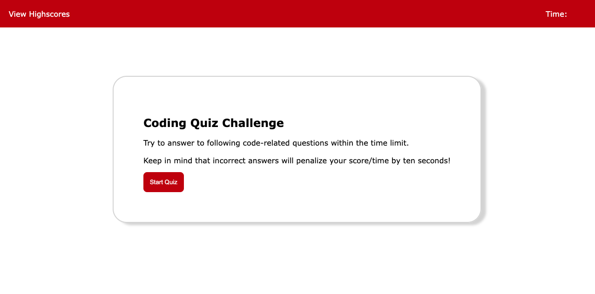
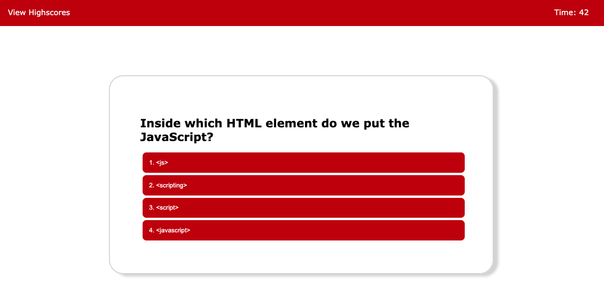
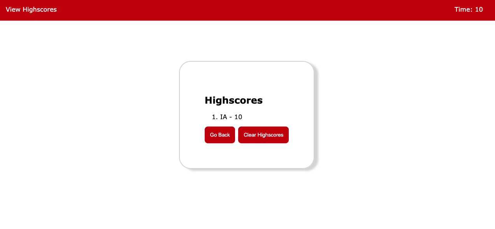

# UCF Bootcamp Quiz

## Description
The challenge is to create a functioning online-quiz to test the users knowledge on the subject. Once the quiz is completed, you may put your initials  and see your final score.

 

## Deployed Project
https://atlas-ware.github.io/UCF_BootcampQuiz_04/

 

## Mock-Up
 
    
  
          
    

    
  
          
    

    
  
          
    

 

## Usage (Quiz specifics)

Quiz's Functionality:
1)  WHEN the user click the start button a timer starts and the user is presented with a question.
2)  WHEN the user answers a question then the user is presented with another question.
3)  WHEN the user answers a question incorrectly then the time is subtracted from the clock.
4)  WHEN all the questions are answered or the timer reaches 0, then the game is over.
5)  WHEN the game is over then the user can save their initials and their score.

